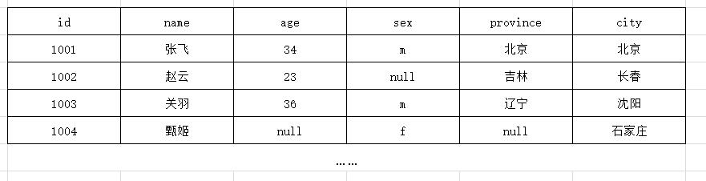

## RDBMS的表模型(扩展)

我们先来了解以下传统型数据库的存储结构，也就是表模型（参考下图）：

```
- 关系型数据库采用表格的存储方式，数据按行和列进行存储，读取和查询十分方便。
- 关系型数据库存储结构化的数据，存储前必须先定义好表结构，即各个列(字段)。
```



关系型数据库的特点：

```
1. 存储结构：以表格的形式存储结构化的数据，需要事先定义好表的结构(字段名称，字段类型，字段个数)，数据存储在行与列的交汇处(称之为Cell单元格)
2. 存储规范：为了充分利用存储空间，尽可能的避免重复(数据冗余)，按照数据最小关系表的形式存储，数据清晰，一目了然
3. 查询方式：采用结构化查询语言(SQL)对数据进行管理。
4. 事务性：为了保证数据的商业业务逻辑以及数据安全性，支持ACID的事务特性
5. 读写性能：关系型数据库追求的是数据实时性和数据的一致性，

缺点总结：
1. 一旦数据表中存储数据后，修改表结构变得特别困难。
2. 如果我们想扩展字段时，会对表结构产生影响。
3. 即使某一行中的某个字段没有赋值，也要使用null填充
4. 一旦涉及到多张表，因为数据表存在着复杂的关系，管理非常不方便。	
5. 一旦面对海量数据的处理时,读写性能特别差，尤其在高并发这一块。
```

## Hbase的表模型

HBase是一个面向列的非关系型数据库，区别于面向行存储的关系型数据库。

### HBASE表模型的要点

```properties
1. Hbase表的基本存储单位是一个单元格(Cell)，也可以称之为列(Column)。
2. 单元格内存储的是一对key-value键值对。
3. 每一个key-value键值对都有N个时间戳作为版本号(版本数量可以配置)
4. 为了管理不同的key-value,hbase引入了列簇(列族)的概念，
	- 一个表可以有多个列簇（不同列簇的数据一定会存储在不同文件中，即一个列簇对应一个文件）
	- 一个列族下可以有成千上百万个不同的key-value,即列
5. 为了标识某些key-value键值对是某一个事物的，引入了rowkey的概念。rowkey作为唯一标识符，不能重复。
6. 一张表通常由于数据量过大，会被横向切分成若干个region(用rowkey范围标识)
	- 不同region的数据也存储在不同文件中
7. hbase会对插入的数据按顺序存储：(内存)
  - 要点一：首先会按行键排序
  - 要点二：同一行里面的kv会按列簇排序，再按k排序
```


### HBASE表的物理存储结构


### 存储结构中的概念

**Cell（单元格）**

```
- 关系型数据库中的表模型是由行和列构成，交叉点我们称之为Cell(单元格)，用于存储字段(Column)的数据。
- Hbase的表模型与关系型数据库的表模型不同。在单元格上是以 key-value 形式来存储某一个字段(Column)数据的。
- 版本号（Timestamp）每一个单元格都有自己的版本号。
```


**rowKey(行键)**

```
- 对于每个单元格(列名与值)来说，他属于哪一行记录，尤为重要，因此引入rowkey这个概念，用于区分单元格属于那一行记录，
- 在Hbase中的表中的rowkey不能重复
```

**列族(Column family)：**

```
思考一下，面向列的数据库，只需要有列就行了，为什么还要有列族呢？

1. 列族是是多个列的集合。用于统一管理相似的列数据。
2. Hbase会尽量把同一个列族的列放在同一个服务器上，这样可以提高存取效率，可以批量管理有关联的一堆列。
3. 一个列族对应一个目录。不同的列族一定存储在不同的文件中
	强调：业务需求一般也都是查询相关列信息，而非select *
4. hbase在建表时，指定的是列族，而非列，列族的个数有限制(默认是10个)
5. 列族是由多个列组成，列族的成员可以有上百万个。
6. 列族成员的表示方式：ColFamiName:colName
```

### HBASE的表中能存储数据类型

```properties
- hbase中只支持byte[] 
- 此处的byte[] 包括了： rowkey,key,value,列簇名,表名
```

### HBASE与RDBMS和NOSQL区别

```properties
HBase的表数据存储在HDFS文件系统中。
从而，hbase具备如下特性：存储容量可以线性扩展； 数据存储的安全性可靠性极高！
- hbase的表模型跟mysql之类的关系型数据库的表模型差别巨大
- hbase的表模型中有：行的概念；但没有字段的概念  
- 行中存的都是key-value对，每行中的key-value对中的key可以是各种各样，每行中的key-value对的数量也可以是各种各样
```

## HBASE的体系架构

### 图示


### 组件说明

```properties
1. Client : hbase客户端，
   - 包含访问hbase的接口。比如，linux shell，java api。
   - 除此之外，它会维护缓存来加速访问hbase的速度。比如region的位置信息。
2. Zookeeper ：
   - 监控Hmaster的状态，保证有且仅有一个活跃的Hmaster。达到高可用。
   - 它可以存储所有region的寻址入口。如：root表在哪一台服务器上。
   - 实时监控HregionServer的状态，感知HRegionServer的上下线信息，并实时通知给Hmaster。
   - 存储hbase的部分元数据。
3. HMaster :
   - 1. 为HRegionServer分配Region（新建表等）。
   - 2. 负责HRegionServer的负载均衡。
   - 3. 负责Region的重新分配
   		- HRegionServer宕机之后的Region分配，
   		- HRegion裂变：当Region过大之后的拆分）。
   - 4. Hdfs上的垃圾回收。
   - 5. 处理schema的更新请求
4. HRegionServer ：
   - 1. 维护HMaster分配给的Region（管理本机的Region）。
   - 2. 处理client对这些region的读写请求，并和HDFS进行交互(Hlog的写入，HFile的读写)。
   - 3. 负责切分在运行过程中逐渐变大的Region。
5. HLog ：
   - 1. 对HBase的操作进行记录，使用WAL写数据，优先写入Hlog.
   		比如：put操作时，先写日志再写memstore，这样可以防止数据丢失，即使丢失也可以回滚。
6. HRegion ：
   - 1. HBase中分布式存储和负载均衡的最小单元，它是表或者表的一部分。
7. Store ：
   - 1. 相当于一个列簇
8. Memstore ：
   - 1. 内存缓冲区，用于将数据批量刷新到hdfs中，默认大小为128M
9. HStoreFile :
   - 1. 和HFile概念一样，不过是一个逻辑概念。HBase中的数据是以HFile存储在Hdfs上。
```

### 组件之间的关系

```properties
hmaster:hregionserver=1:*
hregionserver:hregion=1:*
hregionserver:hlog=1:1
hregion:hstore=1:*
store:memstore=1:1
store:storefile=1:*
storefile:hfile=1:1
```


### 小结

```properties
rowkey:行键，和mysql的主键同理，不允许重复。
columnfamily: 列簇，列的集合之意。
column:列
timestamp:时间戳，默认显示最新的时间戳，可用于控制k对应的多个版本值，默认查最新的数据
cell:单元格，kv就是cell

模式：无
数据类型:只存储byte[]
多版本：每个值都可以有多个版本
列式存储：一个列簇存储到一个目录
稀疏存储：如果一个kv为null，不占用存储空间
```

# 
