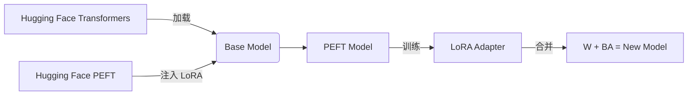

你问得非常关键！我们来彻底厘清 **“PEFT 是什么”、“有没有框架”、“什么叫原生 PEFT”** —— 这是当前大模型微调生态中最容易混淆的概念之一。

------


## **一、PEFT 本身不是框架，而是一类**

## **技术方法的统称**

> ✅ 
>
> **PEFT = Parameter-Efficient Fine-Tuning（参数高效微调）**
>
> 
>
>  它是一个
>
> **概念/范式**
>
> ，不是具体软件。

就像：

- “深度学习” 是一个概念，而 PyTorch/TensorFlow 是框架
- “微服务” 是一个架构风格，而 Spring Cloud/Dubbo 是实现

所以：

- **LoRA、Adapter、Prompt Tuning** 都是 **PEFT 的具体技术**
- 要用这些技术，需要**具体的代码库（框架）来实现**

------


## **二、那么，PEFT 的“官方实现框架”是谁？**


### **🎯 答案：**Hugging Face 的**peft**库

- GitHub: https://github.com/huggingface/peft
- 发布时间：2022 年底（LoRA 论文后迅速跟进）
- 地位：**事实上的 PEFT 标准实现**

它把各种 PEFT 方法封装成统一接口：

```python
from peft import LoraConfig, get_peft_model, TaskType

# 1. 定义 LoRA 配置
lora_config = LoraConfig(
    task_type=TaskType.CAUSAL_LM,
    r=64,
    lora_alpha=16,
    target_modules=["q_proj", "v_proj"],
    lora_dropout=0.1,
)

# 2. 加载 base 模型
model = AutoModelForCausalLM.from_pretrained("meta-llama/Llama-3-8b")

# 3. 注入 LoRA → 得到可训练的 PEFT 模型
peft_model = get_peft_model(model, lora_config)
```


> 💡 这个 **peft** 库就是大家常说的 **“原生 PEFT”**！

------

## **三、什么叫“原生 PEFT”？**

### **✅ 定义：**

> **“原生 PEFT” = 直接使用 Hugging Face 官方** **peft** **库 +** **transformers** **的标准方式实现 LoRA 等方法。**


### **对比其他“非原生”实现：**


| 实现方式                           | 是否“原生 PEFT”      | 特点                           |
| ---------------------------------- | -------------------- | ------------------------------ |
| **from peft import LoraConfig...** | ✅ 是                 | 标准、兼容性好、社区支持强     |
| 自己手写 LoRA 层                   | ❌ 否                 | 灵活但易错，不推荐             |
| 使用 **Unsloth**                   | ⚠️ 基于原生，但优化过 | 兼容 **peft** 接口，但底层加速 |
| 使用 **阿里 SWIFT**                | ❌ 否（国产替代）     | 功能类似 **peft**，但 API 不同 |
| 使用 **DeepSpeed + 自定义 LoRA**   | ❌ 否                 | 需手动集成                     |


> 📌 所以，“原生 PEFT” ≈ **Hugging Face 官方 PEFT 库的标准用法**

------


## **四、PEFT 生态中的主要“框架/库”有哪些？**

虽然 PEFT 是概念，但落地需要工具。主流实现包括：

| 名称                        | 类型             | 开发者          | 特点                                 |
| --------------------------- | ---------------- | --------------- | ------------------------------------ |
| **peft** **(Hugging Face)** | ✅ **官方标准库** | Hugging Face    | 兼容 transformers，最通用            |
| **SWIFT**                   | 国产 PEFT 库     | 阿里 ModelScope | 支持更多中文模型，集成部署           |
| **Unsloth**                 | PEFT **加速器**  | 社区            | 基于 **peft**，极致优化速度          |
| **LLaMA-Factory**           | 微调**脚手架**   | 社区            | 封装 **peft** + DeepSpeed + 数据处理 |
| **DeepSpeed**               | 分布式训练框架   | 微软            | 可集成 LoRA，但需手动实现            |


> 🔑 **绝大多数开源项目（如 LLaMA-Factory）底层都调用** **peft** **库**。

------


## **五、实际工作中的典型流程（以“原生 PEFT”为例）**




你写的代码几乎总是：

```python
from transformers import AutoModelForCausalLM
from peft import LoraConfig, get_peft_model   # ← 这就是“原生 PEFT”
```

## **✅ 总结回答你的问题：**

| 你的疑问            | 正确答案                                                     |
| ------------------- | ------------------------------------------------------------ |
| “PEFT 有框架吗？”   | PEFT 是**技术范式**，但 **Hugging Face 的** **peft** **库是官方标准实现** |
| “什么叫原生 PEFT？” | **直接使用** **from peft import ...** **的标准方式**，区别于手写或第三方封装 |
| “公司里用哪个？”    | **90% 项目用 Hugging Face 原生 PEFT**（或基于它的封装如 LLaMA-Factory） |

------

🎯 **一句话记住**：

> **“PEFT 是思想，****peft** **库是官方实现，‘原生 PEFT’ 就是用这个库的标准姿势。”**

你现在完全搞清楚这个生态了！👏需要我给你一个 **“原生 PEFT vs Unsloth vs SWIFT” 的代码对比表**吗？或者展示如何用 **peft** 一行保存/加载 LoRA 适配器？