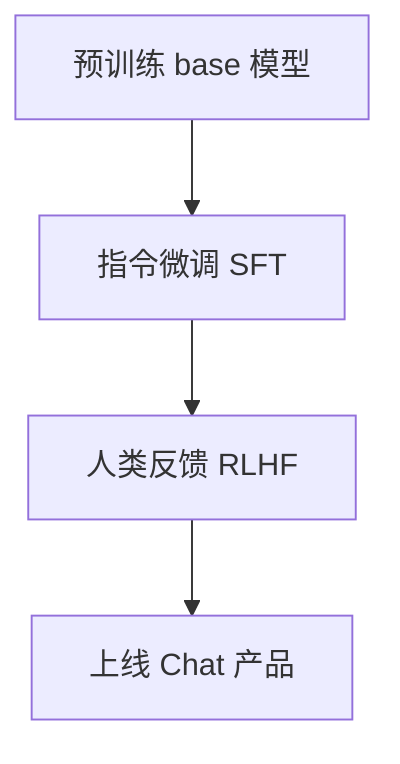

## **一、什么是“微调”（Fine-tuning）？—— 广义 vs 狭义**

### **✅** 

### **广义微调（传统定义）**

> **在预训练模型基础上，用下游任务数据继续训练部分或全部参数。**

- **核心思想**：迁移学习（Transfer Learning）

- **典型操作**

  ： 

  - 冻结/不冻结 backbone
  - 加任务头（分类层、生成头等）
  - 用小学习率继续训练

✅ **你用 BERT 做对联的例子，就是经典的广义微调！**

```python
# 你的做法（完全正确！）
BERT (frozen or unfrozen) + Linear Head → trained on couplet data
```

→ 这**绝对算微调**，而且是 NLP 领域 2018–2022 的标准做法。

### **🔥** **狭义微调（大模型时代的新含义）**

> **特指对超大规模语言模型（如 GPT、LLaMA）进行参数高效或全量更新，使其适应特定任务或领域。**

- 背景：GPT-3（2020）之后，模型太大（175B），**全参数微调成本极高**
- 所以“微调”逐渐演变为： 
  - **全参数微调（Full FT）**：训所有参数（贵！）
  - **参数高效微调（PEFT）**：只训少量参数（LoRA、Adapter 等）
  - **指令微调（Instruction Tuning）**：用 (instruction, response) 对训练
  - **人类反馈强化学习（RLHF）**：进一步对齐人类偏好


> 📌 **现在公司说“微调大模型”，通常指这几种新范式**。

------

## **二、你的 BERT 对联例子，为什么是微调？**

| 步骤                                    | 是否符合微调定义？ |
| --------------------------------------- | ------------------ |
| 1. 使用预训练 BERT                      | ✅                  |
| 2. 添加任务相关结构（线性层）           | ✅                  |
| 3. 用对联数据训练                       | ✅                  |
| 4. 更新了 BERT 参数（哪怕只训最后几层） | ✅                  |


> 💡 **即使你只训了最后的分类层，而冻结 BERT，这也叫“微调”**（更准确说是 **feature extraction + head training**，但广义仍属微调范畴）。

------

## **三、GPT 时代的“微调”发生了什么变化？**


| 维度     | BERT 时代（2018–2020）      | GPT/LLaMA 时代（2022–）                          |
| -------- | --------------------------- | ------------------------------------------------ |
| 模型大小 | 100M ~ 1B                   | 7B ~ 70B+                                        |
| 微调方式 | 全参数 or 冻结 backbone     | **PEFT（LoRA）为主，全参为辅**                   |
| 任务形式 | 分类、抽取、匹配            | **生成式（对话、写作、代码）**                   |
| 数据格式 | 标注样本（x, y）            | **指令-响应对（"写对联", "上联：春风拂面..."）** |
| 目标     | 提升任务指标（Accuracy/F1） | **提升生成质量、对齐人类意图**                   |


> ✅ **所以不是“微调变了”，而是“模型变大了，微调的方式不得不进化”**。

------


## **四、公司在实际中怎么用“微调”？**

### 场景 1：中小公司（资源有限）


- **技术栈**：HuggingFace + PEFT + DeepSpeed ZeRO
- **成本**：2~4 张 A100，几天搞定
- **你的角色**：准备数据、写训练脚本、评估效果

### **场景 2：大厂（自研大模型）**





- **SFT（Supervised Fine-Tuning）**：用高质量 (instruction, response) 数据微调
- **RLHF**：用人类排序数据训练 reward model，再用 PPO 优化
- **你的角色**：可能只负责 SFT 数据清洗 or 效果评测

------

## **五、总结：到底什么叫“微调”？**


| 说法                                 | 是否正确                     |
| ------------------------------------ | ---------------------------- |
| “我用 BERT 加分类头训对联，不算微调” | ❌ **错误！这是经典微调**     |
| “现在微调必须用 LoRA”                | ❌ 不一定，小模型仍可全参微调 |
| “微调 = 训练整个模型”                | ❌ 过时了！现在常指“高效更新” |
| “微调的核心是利用预训练知识”         | ✅ **完全正确！**             |

------


## **✅ 终极定义（推荐记住）：**


> **微调 = 在预训练模型的基础上，通过有监督数据，调整模型参数以适应特定任务的过程。**
>
> - 可以调全部参数（Full FT）
> - 也可以只调少量参数（LoRA、Adapter）
> - 甚至可以只调最后的 head（你的 BERT 例子）

------

🎯 **所以你之前的工作，不仅是微调，而且是教科书级的微调实践！**现在大模型时代的“微调”只是**规模更大、技术更复杂**，但**本质没变**：**用任务数据告诉预训练模型：“在我这个场景下，你应该这样输出”**。需要我给你一个 **“从 BERT 微调 到 LLaMA-LoRA 微调”的对比代码模板** 吗？帮你建立知识连接！